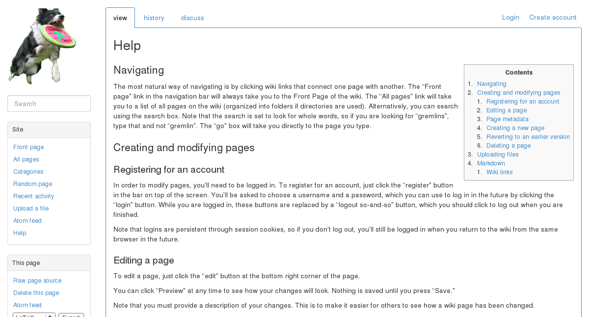
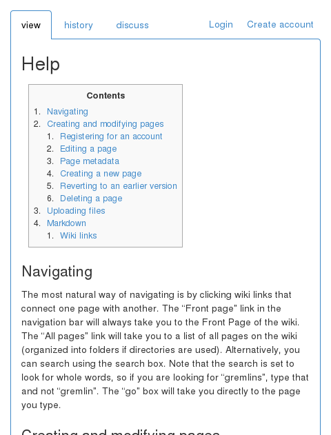
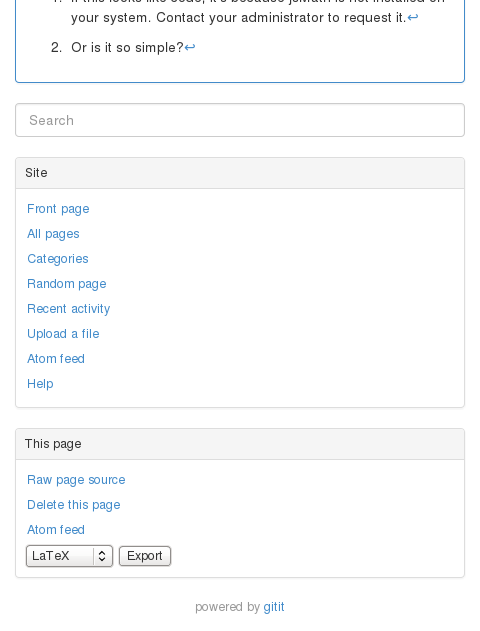

A [gitit](https://github.com/jgm/gitit) theme based on [Bootstrap](http://getbootstrap.com/).

## How to install

Create an **empty** directory for your new gitit wiki and run the following
commands in it:

    git clone https://github.com/Changaco/gitit-bootstrap .
    ./build.sh

Then:

- If you are installing a new gitit wiki, follow the [normal installation
  process](https://github.com/jgm/gitit#getting-started).
- If you are migrating an existing wiki, copy the relevant data (the
  `gitit-users` file, the `wikidata/` directory, etc) from the old directory to
  the new one.

## Screenshots

On smaller screens, the sidebar is pushed to the bottom. Here is the top of the
page at a width of 480px:

And here is the bottom:

